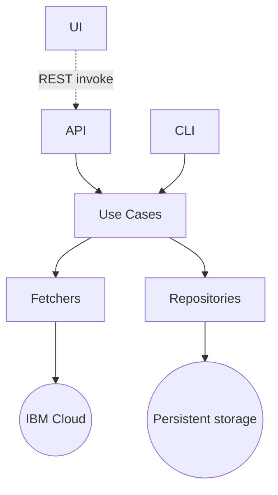

# Claude.md

Guidelines to be used by Claude Code when working with this codebase.

When working with this codebase, prioritize readability over cleverness.

Interview me until you have 95% confidence about what I actually want, not what I think I should want.

## Code structure

The project is a monorepo using Turborepo standards.

```text
.
├── apps
│   ├── api
│   ├── cli
│   └── ui
└── packages
    ├── fetchers
    ├── repositories
    ├── typescript-config
    ├── use-cases
    └── vitest-config
```

### Apps
- API contains all the code related to the backend exposing the features as REST endpoints.
- CLI contains a terminal tool to be able to run administrative tasks.
- UI contains all the code for the React app to show reports to the user.

### Packages
- Fetchers contains all the logic to fetch data from the IBM Cloud API.
- Repositories contain all the logic to persist and read data from the persistent storage.
- Use-cases contain all the business logic.

### Conventions

- Object Oriented Programming is preferred over other paradigms.

## Invocation chain


