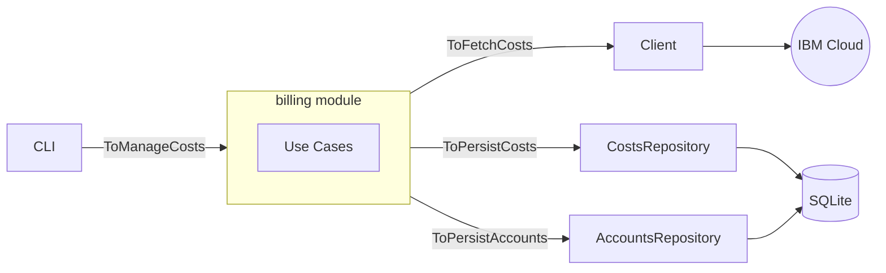

# Costs Dashboard

A monorepo for tracking and visualizing IBM Cloud billing costs. Fetch cost data from IBM Cloud accounts, store it locally, and view it through a web dashboard.

## Project Structure

```
.
├── apps/
│   ├── api       # Express REST API
│   ├── cli       # Terminal tool for fetching costs
│   └── ui        # React dashboard
└── packages/
    ├── billing   # Core billing module (hexagonal architecture)
    ├── eslint-config
    ├── typescript-config
    └── vitest-config
```

## Prerequisites

- Node.js >= 24.16.0
- npm >= 11.6.2
- IBM Cloud API keys for the accounts you want to track

## Getting Started

Install dependencies:

```bash
npm install
```

Build all packages:

```bash
npm run build
```

## CLI Usage

The `costs` CLI fetches billing data from IBM Cloud and stores it locally.

### Configuration file

Create a JSON config file (default: `./costs-config.json`) listing the IBM Cloud accounts to query:

```json
{
  "accounts": [
    { "id": "ACCOUNT_ID_1", "apiKey": "IBM_API_KEY_1" },
    { "id": "ACCOUNT_ID_2", "apiKey": "IBM_API_KEY_2" }
  ]
}
```

### Fetch costs

```bash
# Fetch costs for a single month
costs fetch --from 2024-01

# Fetch costs for a date range
costs fetch --from 2024-01 --to 2024-03

# Use a custom config file
costs fetch --from 2024-01 --config ./my-config.json
```

### Environment variables

| Variable | Default | Description |
|---|---|---|
| `DB_PATH` | `./costs.db` | Path to the SQLite database file |

## Development

Run all apps in watch mode:

```bash
npm run dev
```

Run tests:

```bash
npm test
```

Lint:

```bash
npm run lint
```

## Architecture

The core logic lives in the `billing` package, structured as a **hexagonal architecture**:

```
billing/
└── src/
    ├── domain/         # Core entities (CostEntry, Account, ...)
    ├── ports/
    │   ├── driver/     # ToManageCosts — what callers invoke
    │   └── driven/     # ToFetchCosts, ToPersistCosts, ToPersistAccounts
    ├── services/       # Use cases implementing driver ports
    └── adapters/
        ├── ibm-cloud-costs-fetcher/
        ├── costs-repository/
        └── accounts-repository/
```

The CLI acts as the driver adapter, invoking the billing module through the `ToManageCosts` port. The billing module communicates with IBM Cloud and the local database through its driven adapters.


